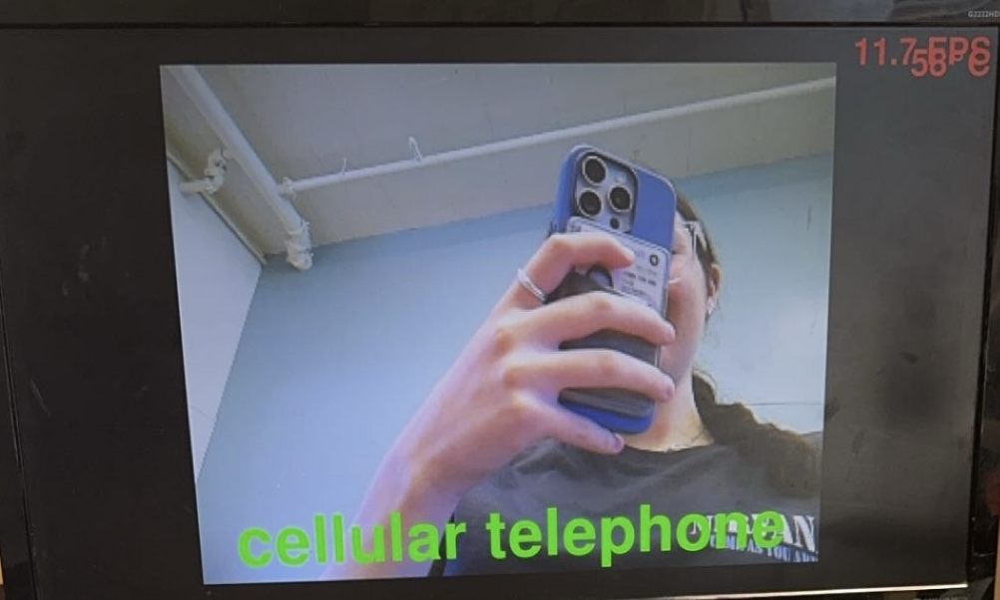
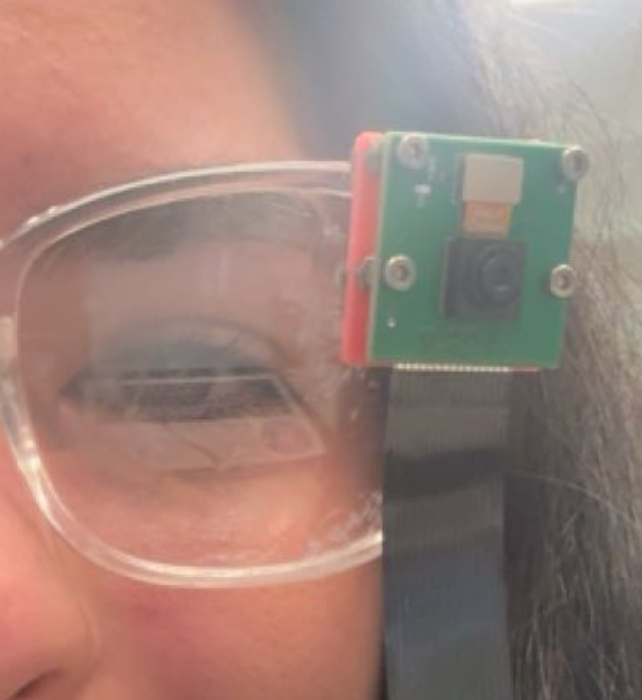

# Object Recognition Glasses

This project involves developing a pair of object recognition glasses, allowing users with visual impairments to identify objects in their surroundings in real-time. Through this project, I gained valuable insights into computer vision, werable technology and machine-learning, culminating in a triumph of creating a functional prototype that enhances user interaction with the enviorment. 

<!---You should comment out all portions of your portfolio that you have not completed yet, as well as any instructions:
```HTML -->
<!--- This is an HTML comment in Markdown -->
<!--- Anything between these symbols will not render on the published site 
```
-->
<!---| **Engineer** | **School** | **Area of Interest** | **Grade** |
|:--:|:--:|:--:|:--:|-->
| Zoe M | SAR High School | Electrical Engineering | Incoming Senior |

<!--- **Replace the BlueStamp logo below with an image of yourself and your completed project. Follow the guide [here](https://tomcam.github.io/least-github-pages/adding-images-github-pages-site.html) if you need help.** -->


  
# Final Milestone
<!---
**Don't forget to replace the text below with the embedding for your milestone video. Go to Youtube, click Share -> Embed, and copy and paste the code to replace what's below.**-->

<iframe width="560" height="315" src="https://www.youtube.com/embed/uUjjY1bmT2M?si=3ZzLWlJyTW76bCXd" title="YouTube video player" frameborder="0" allow="accelerometer; autoplay; clipboard-write; encrypted-media; gyroscope; picture-in-picture; web-share" referrerpolicy="strict-origin-when-cross-origin" allowfullscreen></iframe>

For my third milestone, I wanted to attach the camera to the glasses and ensure that they operated well with the portable power bank. 

**How I did this:**

Before I could attach my camera and use a power bank with my Pi, I needed to download a new object detection model to my Pi because my SD card got corrupted, and I needed to start over. My main guide was a tutorial by Adafruit (see resource 1 below). I started with reimaging a new SD card and starting fresh. I updated and upgraded my Pi and setup a virtual environment, a self-contained directory that allows you to install and manage dependencies separately from other projects on the same computer.

```shell
cd ~
sudo pip3 install --upgrade adafruit-python-shell
wget https://raw.githubusercontent.com/adafruit/Raspberry-Pi-Installer-Scripts/master/raspi-blinka.py
sudo python3 raspi-blinka.py
```
<sub>Correctly configuring my Pi and installing Blinka</sub>

I then ran adafruit’s pre-written script to ensure my Pi was correctly configured and to install a software called Blinka which enables other interfaces that are required for the object detection to run. Most of the code was installing the dependencies, external libraries or packages that your program relies on to function properly.

```shell
rpicamera-hello -t 0
```
<sub>Testing camera</sub>

I then tested my camera with the command above to ensure all my hardware aspects were working as they should. Once this was confirmed I was able to install Tensorflow, which is the software that enables the object detection to occur. 

```shell
sudo apt install -y python3-numpy python3-pillow python3-pygame
sudo apt install -y festival
```
<sub>installing python packages and TTS model</sub>

I had to install some Python packages that TensorFlow required in addition to installing the speech output package, the Text-to-Spech (TTS) model called “Festival”. This will be used for the second half of the object detection which is transforming the classification to sound so the user can hear the classification through an ear piece. 

```shell
cd ~
source env/bin/activate
git clone --depth 1 https://github.com/adafruit/rpi-vision.git
cd rpi-vision
pip3 install -e .
```
<sub>Installing spi-vision</sub>

I then was able to install rpi-vision which is the name of the program that executes the object recognition using the MobileNet V2 machine learning model to detect objects. 

```shell
RELEASE=https://github.com/PINTO0309/Tensorflow-bin/releases/download/v2.15.0.post1/tensorflow-2.15.0.post1-cp311-none-linux_aarch64.whl
CPVER=$(python --version | grep -Eo '3\.[0-9]{1,2}' | tr -d '.')
pip install $(echo "$RELEASE" | sed -e "s/cp[0-9]\{3\}/CP$CPVER/g")
sudo reboot
```
<sub>Installing TensorFlow</sub>

Once rpi-vision was downloaded it was time to actually install TensorFlow. I downloaded version 2.15.0 by running the commands above. Most of the code above figures out the current version of CPython running on my Pi, substitutes that in, and downloads and installs the appropriate release file. This is important to ensure everything is compatible and I dont have problems with conflicting versions and incompatible dependencies. 

```shell
sudo apt-install libhdf5-dev
sudo pip3 install h5py==3.10.0
```
<sub>Enabling the code to run with my OS system</sub>

I then realized that the code provided in the tutorial was not exactly compatible with the Raspberry Pi operating system (OS) I was running. Therefore I had to run some extra commands the ensure that the code could run on a 64 bit rpi arm_64 architecture. 

```shell
cd rpi-vision
python3 tests/pitft_labeled_output.py --tflite
```
<sub>Running the object detection code</sub>



Finally I was ready to run the detection software. I went into my rpi-vision directory and entered the code that runs the python file named “pitft_labeled_output” using TensorFlow Lite, a smaller and lighter version of TensorFlow that is optimized for small devices like the Raspberry Pi. Then the object detection window popped up, as seen above, and my object detection was working!

```shell
echo "This is a test" | festival --tts
```
<sub>Testing the TTS model</sub>

Then it was time to add the TTS model and earpiece to my project. I first plugged my ear piece into the audio port of the Raspberry Pi and then ran the code above to test it. Once I confirmed both the ear piece and the TTS model were working I tested my project again and the object detection with speech output was working! 

After the software was working, I needed to put the glasses together by putting both the camera and the ear piece onto the glasses. However, I didnt want to glue the camera directly onto the glasses because there were electrical components that could easily be ruined with hot glue. I decided I needed to use computer aided design (CAD) to 3D print a cover for the back of the camera.

<!----->


I took measurements of both the perimeter of the camera as well as the diameter and distance of the holes in the camera as well. I then created my design seen above and sent it to the 3D printer. Once I got my cover I screwed it onto the camera with nails and then hot glued the case onto the glasses, as seen above. I opted to keep the ear piece disconnected from the glasses so due to many people having unique sizing of their ears relative to their head, so I didn't want to limit anyone from being able to use the glasses. 

As my glasses were just about done I went through my code and profiled it, which means I added comments explaining the code so that both myself and others can understand it better and even use it for their projects in the future! (See full code below with comments.)

**Challenges Throughout BlueStamp Engineering:**

During my time at BSE, I encountered several significant challenges that tested my problem-solving skills and resilience. One of the major hurdles was dealing with incompatible libraries and packages while setting up my project. This required extensive research and trial-and-error to find compatible versions that worked seamlessly together. Additionally, I faced the daunting setback of my SD card becoming corrupted not once, but three times throughout the project. Each time, I had to start from scratch, reinstalling the operating system, libraries, and configurations, which was time-consuming and frustrating. Furthermore, ensuring that the software I downloaded was compatible with the specific version of the Raspberry Pi's operating system added another layer of complexity to the project.

**Triumphs Throughout BlueStamp Engineering:**

Despite these challenges, the journey at BSE was filled with triumphs and valuable learning experiences. I successfully gained proficiency in utilizing a Raspberry Pi effectively, understanding its capabilities, limitations, and optimal configurations for various applications. Integrating software with hardware was a pivotal aspect of my learning, where I grasped how different components interact and collaborate to achieve desired functionalities. Learning Computer-Aided Design (CAD) was instrumental, as it enabled me to design and prototype components for 3D printing, enhancing the physical aspects of my project.

Moreover, a crucial takeaway from this experience was recognizing the importance of deeply understanding the software tools and libraries being employed. This comprehension not only facilitated smoother integration but also empowered me to troubleshoot effectively and innovate creatively when faced with challenges.

Each setback encountered during the project became an opportunity for growth and improvement. It taught me resilience and the ability to adapt my approach, leading to more refined solutions and a deeper understanding of the project's intricacies.

**What's After BlueStamp Engineering:**

Looking forward, I am eager to expand my knowledge and skills in several areas. Firstly, I am eager to delve into creating my own machine learning models, applying them to enhance the capabilities of my projects. Additionally, exploring mechanical components such as servos, ultrasonic sensors, and other actuators will broaden my understanding of physical computing and automation. Lastly, mastering the development of applications to control both software and hardware interfaces seamlessly is a goal that aligns with my aspiration to create more sophisticated and integrated systems in the future.

# Second Milestone

<iframe width="560" height="315" src="https://www.youtube.com/embed/eSBxkj7FgYQ?si=g7Ch2Kw9N8AXNzG2" title="YouTube video player" frameborder="0" allow="accelerometer; autoplay; clipboard-write; encrypted-media; gyroscope; picture-in-picture; web-share" referrerpolicy="strict-origin-when-cross-origin" allowfullscreen></iframe>

For my second milestone, I implemented a text-to-speech model (TTS) into my project, which takes the classification and reads it out loud into an earpiece. 

**How I did this:**
I started by researching different text-to-speech models on the Internet. I landed on the pyttsx3 model, which is a pre-trained model that works well with the Raspberry Pi due to its straightforward Python interface, offline functionality, customizable speech parameters, and compatibility with Python 3. 

```shell
Pip install pyttsx3
```
```python
Import pyttsx3
```
<sub>Installing and importing pyttsx3</sub>

First, I installed the TTS model into my console so I could import it into my Python file, where my script is running to perform the object recognition. 

```python
#intializes the text to speech engine using the pyttsx3 library 
engine = pyttsx3.init()
engine.setProperty(‘rate’, 90) #speed of speech (wpm)
engine.setProperty(‘volume’, 1.0) #volume of speech (scale of 0.0 - 1.0)
```
<sub>creating engine and setting properties for speech</sub>

After I imported the TTS model into my code, I initialized the engine using the pyttsx3 library. This means I set up a TTS engine that can convert written text into spoken words using the data from the pyttsx3 library. I then set the speed and volume of the speech to 90 words per minute (wpm) and the loudest volume. 

```python
# Show classification results on the image
    for idx, category in enumerate(categories.classifications[0].categories): #iterates through each category detected by the classifier
      category_name = category.category_name #retrieves name of category
      score = round(category.score, 2) #rounds confidence score of the category to 2 decimal places
      result_text = category_name + ' (' + str(score) + ')' #text string that combines the category name and score
      text_location = (_LEFT_MARGIN, (idx + 2) * _ROW_SIZE) #determines position where text will be displayed on the image
      cv2.putText(image, result_text, text_location, cv2.FONT_HERSHEY_PLAIN,
                  _FONT_SIZE, _TEXT_COLOR, _FONT_THICKNESS) #draws text onto image at the specified location
      if score >= 0.6: #checks if confidence score is greater than or equal to 0.6
          print("{} {}".format(category_name, score)) #prints the category name and score to the console
```
<sub>Showing the classification code and the print function that prints above a score of 0.6</sub>


My next step was to get the model to print only the high confidence scores into my console so that they would be the correct object feasibly. I chose a score greater than or equal to 0.6, which means the model is 60% sure that the input object is that exact classification. I noticed that when objects were wrongly detected, they usually had very low confidence scores. Therefore, 60% is a suitable tested threshold for the model. I wrote an if statement that checks if the score is greater than or equal to 0.6, and then if that returns true, it prints the category name and score to the console. 

```python
engine.say(category_name) #uses text-to-speech engine to speak category name
engine.runAndWait() #ensures the TTS engine finishes speaking before continuing
```
<sub>Code showing speak and wait functions of the TTS model</sub>

After I got the model to print only the classifications with a confidence score of 0.6 and above it was time to get the model to actually say those classifications. So I wrote the line “engine.say(category_name)” which says only the category name of the classifications with a confidence score of 0.6 and above. The final step was the let the TTS engine know to wait until it finishes speaking a word to continue with the next word. 

```shell
Speaker-test -c4 -twav -13
```
<sub>Code testing the speaker</sub>

I then tested the earpiece using the code above before running my classification code to ensure it was working correctly and that I could hear the words well. After I confirmed the price was working, it was time to run the “python3 classify.py” script, and it worked!

After I completed the TTS model, I wanted to start profiling my code and adding comments to make it easier for myself and others to understand. See the complete code below.

**What surprised me so far:**
So far, I’ve been surprised by how many resources there are on the Internet for coding and engineering in general. When in doubt, if I run into an error and Google it, there is usually someone who has gone through a similar difficulty and solved the problem. I love how open the engineering community is and how willing everyone is to help out each other. This culture of sharing knowledge has empowered me to develop significantly as an engineer. It has allowed me to independently tackle challenges by conducting research and investing time, without having to rely on the immediate availability of a teacher or mentor.

**Challenges:**
My main challenge with this milestone was writing the code for speaking the classification out loud without researching return values. Return values are how functions communicate what they have done or calculated back to the rest of your program. However, originally, I put the entire print statement into my speak function. 

```python
engine.say(print("{} {}".format(category_name, score))
```
<sub>Speak function that would return "none"</sub>

The problem with doing so is that print does not have a return value because its purpose is just to print text onto the console. Therefore, my earpiece kept saying “none” for every object classification. It took me a while to figure out what the TTS model was saying and then out why it was saying “none”. After I realized it was because I put the print statement into my speak function, I quickly changed this to “category_name” and it was working. 

**Next:**

I need to make sure I attach the Raspberry Pi, the camera, and the earpiece to my glasses before reaching my final milestone. After that, I will test all the components using a portable charger to ensure everything works properly and can be portable. 


# First Milestone

<!--- **Don't forget to replace the text below with the embedding for your milestone video. Go to Youtube, click Share -> Embed, and copy and paste the code to replace what's below.** -->

<iframe width="560" height="315" src="https://www.youtube.com/embed/O-T2S3FNzZ4?si=XUDs_auTNl4_j2Pt" title="YouTube video player" frameborder="0" allow="accelerometer; autoplay; clipboard-write; encrypted-media; gyroscope; picture-in-picture; web-share" referrerpolicy="strict-origin-when-cross-origin" allowfullscreen></iframe>

For my first milestone I performed object recognition using machine learning. I ran this on a Raspberry Pi (a credit card sized computer) and a Pi Camera. 

**How I did this:** 
First I needed to setup up my Raspberry pi. My main guide in doing so was Adafruit’s tutorial (see resource 1 below). First I chose the Raspberry Pi operating system (OS) (64 bit) since that was most compatible with my Pi. 

```shell
sudo apt update 
sudo apt upgrade
sudo apt install python3.11-venv
python -m venv env --system-site-packages
source env/bin/activate
```
<sub>Setting up a virtual enviorment and installing python</sub>

I then updated and upgraded my Raspberry Pi so that everything in the Raspberry pi was up to date. Then I had to download python onto my Raspberry Pi so I could utilize it to use other libraries later on. I did this on a virtual environment, a space where you can install different versions of software or libraries without them interfering with each other. 

```shell
cd ~
sudo pip3 install --upgrade adafruit-python-shell
wget https://raw.githubusercontent.com/adafruit/Raspberry-Pi-Installer-Scripts/master/raspi-blinka.py
sudo python3 raspi-blinka.py
```
<sub>Installing dependencies</sub>

This code ensured my Pi was configured correctly and mostly just installed the dependencies, the building blocks or "ingredients" that software relies on to do its job effectively. After all that was downloaded onto my Pi it was time to attach my camera and test it out to ensure it worked. 

```shell
libcamera-hello
```

I connected the camera to the pi and needed to test it. I typed out this command to test my camera and it turned on and it started working by showing a live feed window of what the camera sees. After the camera was working it was time to implement the object detection. I followed a tutorial by Sam Westby Tech to download the necessary libraries to get the object detection working (see resource 2 below).

```shell
mkdir project
cd project
source env_tf/bin/activate
sudo apt install -y build-essential cmake pkg-config libjpeg-dev libtiff5-dev libpng-dev libavcodec-dev libavformat-dev libswscale-dev libv4l-dev libxvidcore-dev libx264-dev libfontconfig1-dev libcairo2-dev libgdk-pixbuf2.0-dev libpango1.0-dev libgtk2.0-dev libgtk-3-dev libatlas-base-dev gfortran libhdf5-dev libhdf5-serial-dev libhdf5-103 libqt5gui5 libqt5webkit5 libqt5test5 python3-pyqt5 python3-dev
pip install "picamera[array]"
Pip install opencv-python
python3
import cv2
cv2.__version__
```
<sub>Making a new directory and downloading OpenCV and Picamera libraries</sub>

First I wanted to make a new directory called project, which is basically making a new folder to store things. Then I activated a new virtual environment since I would be downloading a lot of packages and libraries. Next, I needed to install a bunch of system packages, which provide essential tools and updates that allow your operating system and applications to work correctly and securely. After that was done, I installed two libraries called picamera and opencv which allowed my pi to work with the camera and get data from the camera. 

```shell
python3 -m pip install tflite-runtime
python3
import tflite_runtime
tflite_runtime.__version__
quit()
```
<sub>Installing Tensorflow Lite</sub>

Following this I was able to install Tensorflow Lite which provides pre-trained models for various tasks like object detection, which is trained on labeled data. Once the pre-trained model is integrated, the tensorflow lite interpreter runs an inference on input images fed into the model and outputs detection. This means it takes the input images, puts it through its network and performs a variety of math operations. After, it produces an output with a confidence score of how certain the model is that the input is a certain object. 

```shell
git clone https://github.com/tensorflow/examples --depth 1
cd examples/lite/examples/image_classification/raspberry_pi/
sh setup.sh
sudo apt-get install libatlas-base-dev
python3 classify.py
```
<sub>Installing pre-trained Tensorflow Lite ML model</sub>


Afterwards I downloaded a pre-made machine learning data set that Tensorflow Lite created so I could use it for my object detection. Then I tested it by executing the python script “python3 classify.py” which runs the code in the file classify.py and my object detection was working!


**Challenges:**
The tutorial I was following for setting up my camera was a bit outdated and instructed me to turn on settings on my pi that actually were not compatible with the code I was running. Therefore my camera was not turning on. After realizing this I turned off the settings the tutorial had me turn on and my camera started working!

```shell
python3 -m pip install --upgrade tflite-support==0.4.3
```

Also, when downloading Tensorflow Lite I got an error message. Through searching google I found out it was because a package within the Tensorflow Lite library was not compatible with my versions of python and opencv. Therefore I had to execute a command that downgraded the version of that package so it was compatible with my versions of python and opencv. Once I did that Tensorflow Lite downloaded!

Additionally, the image classification is not the most accurate because it's a pre-trained model so in future milestones I hope to be able to narrow down the classifications so it only tells the user when it is pretty sure of its object classification. 

**Future Plan:**
I want to get the classification to be told out loud through the ear piece and put it onto the glasses. This aspect is essential to my project because it allows the user to be able to hear what the classification is that Tensorflow Lite has detected. Based on a study from ARVO journals, in 2020 there were 49.1 million people who were blind globally. Therefore it is crucial that these people have a device that enables them to navigate their everyday lives more easily and be able to detect object they run into during their days. 

<!---
# Schematics 
Here's where you'll put images of your schematics. [Tinkercad](https://www.tinkercad.com/blog/official-guide-to-tinkercad-circuits) and [Fritzing](https://fritzing.org/learning/) are both great resoruces to create professional schematic diagrams, though BSE recommends Tinkercad becuase it can be done easily and for free in the browser. 
-->
# Code

```python
# SPDX-FileCopyrightText: 2021 Limor Fried/ladyada for Adafruit Industries
# SPDX-FileCopyrightText: 2021 Melissa LeBlanc-Williams for Adafruit Industries
#
# SPDX-License-Identifier: MIT

# import necessary python modules
import time
import logging
import argparse
import pygame
import os
import subprocess
import sys
import numpy as np
import signal

#constants define threshold used in the object detection logic
CONFIDENCE_THRESHOLD = 0.5   # at what confidence level do we say we detected a thing
PERSISTANCE_THRESHOLD = 0.25  # what percentage of the time we have to have seen a thing

#prints a message when a sighup signal is caught, ensures program dosent wuit unexpectedly upon recieving this signal
def dont_quit(signal, frame):
   print('Caught signal: {}'.format(signal))
signal.signal(signal.SIGHUP, dont_quit)

# App: import specific classes from custom modules part of setup for vision process
from rpi_vision.agent.capturev2 import PiCameraStream
from rpi_vision.models.mobilenet_v2 import MobileNetV2Base

#configures basic logging settings, logging level set to INFO (INFO level log and above will be displayed)
logging.basicConfig()
logging.getLogger().setLevel(logging.INFO)

# initialize the display (pygame) and a full screen display is created
pygame.init()
screen = pygame.display.set_mode((0,0), pygame.FULLSCREEN)
capture_manager = None

#controls various aspects of programs behavior such as using TFLite, rotating display, including top layer
def parse_args():
    parser = argparse.ArgumentParser()
    parser.add_argument('--include-top', type=bool,
                        dest='include_top', default=True,
                        help='Include fully-connected layer at the top of the network.')

    parser.add_argument('--tflite',
                        dest='tflite', action='store_true', default=False,
                        help='Convert base model to TFLite FlatBuffer, then load model into TFLite Python Interpreter')

    parser.add_argument('--rotation', type=int, choices=[0, 90, 180, 270],
                        dest='rotation', action='store', default=0,
                        help='Rotate everything on the display by this amount')
    args = parser.parse_args()
    return args

#manage history of the last object spoken aloud, respectively
last_seen = [None] * 10
last_spoken = None

# capture_manager is intialized with picamerastream: handles streaming
def main(args):
    global last_spoken, capture_manager

    capture_manager = PiCameraStream(preview=False)

# depending on 'argd.rotation', buffer is intialized as a pygame surface with dimensions matching the screens width and height
    if args.rotation in (0, 180):
        buffer = pygame.Surface((screen.get_width(), screen.get_height()))
    else:
        buffer = pygame.Surface((screen.get_height(), screen.get_width()))

# mouse visibility turned off
    pygame.mouse.set_visible(False)
    screen.fill((0,0,0))
   
# attempts to load and display an image and image is rotated, scaled, and centered    
    try:
        splash = pygame.image.load(os.path.dirname(sys.argv[0])+'/bchatsplash.bmp')
        splash = pygame.transform.rotate(splash, args.rotation)
        # Scale the square image up to the smaller of the width or height
        splash = pygame.transform.scale(splash, (min(screen.get_width(), screen.get_height()), min(screen.get_width(), screen.get_height())))
        # Center the image
        screen.blit(splash, ((screen.get_width() - splash.get_width()) // 2, (screen.get_height() - splash.get_height()) // 2))

#if image fails, update display
    except pygame.error:
        pass
    pygame.display.update()

    # Let's figure out the scale size first for non-square images, based on height ratio
    scale = max(buffer.get_height() // capture_manager.resolution[1], 1)
    scaled_resolution = tuple([x * scale for x in capture_manager.resolution])

    # use the default font, but scale it
    smallfont = pygame.font.Font(None, 24 * scale)
    medfont = pygame.font.Font(None, 36 * scale)
    bigfont = pygame.font.Font(None, 48 * scale)

    # include or exclude the top fully connected layers
    model = MobileNetV2Base(include_top=args.include_top)

    # camera stream started and loop continues as long as stream is active
    capture_manager.start()
    while not capture_manager.stopped:
        if capture_manager.frame is None:
            continue
        #buffer surface is cleared to be prepared for a new frame
        buffer.fill((0,0,0))
        # captures latest camera frame
        frame = capture_manager.read()
        # get the raw data frame & swap red & blue channels
        previewframe = np.ascontiguousarray(capture_manager.frame)
        # make it an image and scales it
        img = pygame.image.frombuffer(previewframe, capture_manager.resolution, 'RGB')
        img = pygame.transform.scale(img, scaled_resolution)

        # calculates the centered region of 'img' then scales
        cropped_region = (
            (img.get_width() - buffer.get_width()) // 2,
            (img.get_height() - buffer.get_height()) // 2,
            buffer.get_width(),
            buffer.get_height()
        )

        # draw it!
        buffer.blit(img, (0, 0), cropped_region)

        #records the current time for permofamce measurement
        timestamp = time.monotonic()
        # depending on args the model makes predictions on current frame  
        if args.tflite:
            prediction = model.tflite_predict(frame)[0]
        else:
            prediction = model.predict(frame)[0]
       
        # result is logged
        logging.info(prediction)
       
        # delta calculates the time taken for inference
        delta = time.monotonic() - timestamp
        # records the inference time and FPS
        logging.info("%s inference took %d ms, %0.1f FPS" % ("TFLite" if args.tflite else "TF", delta * 1000, 1 / delta))
        print(last_seen)

        # calulates and adds FPS on top corner of image
        fpstext = "%0.1f FPS" % (1/delta,)
        fpstext_surface = smallfont.render(fpstext, True, (255, 0, 0))
        fpstext_position = (buffer.get_width()-10, 10) # near the top right corner
        buffer.blit(fpstext_surface, fpstext_surface.get_rect(topright=fpstext_position))
       
        # reads the RPIs CPU temperature and positions below the FPS
        try:
            temp = int(open("/sys/class/thermal/thermal_zone0/temp").read()) / 1000
            temptext = "%d\N{DEGREE SIGN}C" % temp
            temptext_surface = smallfont.render(temptext, True, (255, 0, 0))
            temptext_position = (buffer.get_width()-10, 30) # near the top right corner
            buffer.blit(temptext_surface, temptext_surface.get_rect(topright=temptext_position))
        except OSError:
            pass
        # iterates over each prediction and extracts the objects name, confidence and checks if it exceeds the threshols
        for p in prediction:
            label, name, conf = p
            if conf > CONFIDENCE_THRESHOLD:
                #prints if above threshold
                print("Detected", name)

                # adds the detected objects name to last seen
                persistant_obj = False  # assume the object is not persistant
                last_seen.append(name)
                #removes the oldest entry from 'last_screen'
                last_seen.pop(0)

                # calculates the reatio of times name appears to the total length of 'last_seen'
                inferred_times = last_seen.count(name)
                if inferred_times / len(last_seen) > PERSISTANCE_THRESHOLD:  # over quarter time
                    persistant_obj = True
               
                # replases underscores with spaces for better readability
                detecttext = name.replace("_", " ")
                detecttextfont = None
               
                # iterates through different fronts and computes size of text
                for f in (bigfont, medfont, smallfont):
                    detectsize = f.size(detecttext)
                   
                   # checks if the width of 'detecttext' fits within the screen
                    if detectsize[0] < screen.get_width(): # it'll fit!
                        detecttextfont = f
                        break
                else:
                    detecttextfont = smallfont # well, we'll do our best
                #changes color to green if persistant, white otherwise
                detecttext_color = (0, 255, 0) if persistant_obj else (255, 255, 255)
                detecttext_surface = detecttextfont.render(detecttext, True, detecttext_color)
                #calculates position to place in center
                detecttext_position = (buffer.get_width()//2,
                                       buffer.get_height() - detecttextfont.size(detecttext)[1])
                buffer.blit(detecttext_surface, detecttext_surface.get_rect(center=detecttext_position))

                #checks if object is persistant and hasnt been spoken yet
                if persistant_obj and last_spoken != detecttext:
                    #speaks 'detecttext' using the 'festival' TTS tool
                    subprocess.call(f"echo {detecttext} | festival --tts &", shell=True)
                    #updates last spoken to detecttext
                    last_spoken = detecttext
                break #exists the 'for' loop
        # if for loop dosent detect an object above confidence level
        else:
            last_seen.append(None)
            last_seen.pop(0)
            if last_seen.count(None) == len(last_seen):
                last_spoken = None

        #rotates the buffer surface and draws to screen and updates display
        screen.blit(pygame.transform.rotate(buffer, args.rotation), (0,0))
        pygame.display.update()
# runs only if the script is executed directly
if __name__ == "__main__":
    #parses command line arguments
    args = parse_args()
    try:
        # try main function
        main(args)
    #if user presses Ctrl+C capture manager stops
    except KeyboardInterrupt:
        capture_manager.stop()
```

# Bill of Materials
<!--- Here's where you'll list the parts in your project. To add more rows, just copy and paste the example rows below.
Don't forget to place the link of where to buy each component inside the quotation marks in the corresponding row after href =. Follow the guide [here]([url](https://www.markdownguide.org/extended-syntax/)) to learn how to customize this to your project needs. -->

| **Part** | **Note** | **Price** | **Link** |
|:--:|:--:|:--:|:--:|
| Raspberry Pi 4 | Allows the interaction between the software and hardware for the camera and audio system | $58.99 | <a href="https://www.amazon.com/dp/B0CMZST24Y?ref=cm_sw_r_cso_cp_apin_dp_Y63HAE5CHH0DGMEAV253_1&ref_=cm_sw_r_cso_cp_apin_dp_Y63HAE5CHH0DGMEAV253_1&social_share=cm_sw_r_cso_cp_apin_dp_Y63HAE5CHH0DGMEAV253_1&starsLeft=1"> Link </a> |
| Camera Module | Taking videos for the object recognition | $14.49 | <a href="https://www.amazon.com/dp/B01ER2SKFS?ref=cm_sw_r_cso_cp_apin_dp_1CTZAM6W55YVQMMQNVET&ref_=cm_sw_r_cso_cp_apin_dp_1CTZAM6W55YVQMMQNVET&social_share=cm_sw_r_cso_cp_apin_dp_1CTZAM6W55YVQMMQNVET&starsLeft=1"> Link </a> |
| Raspberry Pi audio expansion board | Enables the connection between the Pi and the audio | $25.99 | <a href="https://www.amazon.com/dp/B0D12M8D2T?ref=cm_sw_r_cso_cp_apin_dp_8G3N848P2VK3FW7TT4BB_1&ref_=cm_sw_r_cso_cp_apin_dp_8G3N848P2VK3FW7TT4BB_1&social_share=cm_sw_r_cso_cp_apin_dp_8G3N848P2VK3FW7TT4BB_1&starsLeft=1"> Link </a> |
| Ear Piece | Allows user to hear the audio in ear | $10.95 | <a href="https://www.amazon.com/dp/B07YZ6LLDH?ref=cm_sw_r_cso_cp_apin_dp_04A8H7YD6WEPZYG52YZK&ref_=cm_sw_r_cso_cp_apin_dp_04A8H7YD6WEPZYG52YZK&social_share=cm_sw_r_cso_cp_apin_dp_04A8H7YD6WEPZYG52YZK&starsLeft=1"> Link </a> |
| Glasses | Allows user to wear the device | $5.99 | <a href="https://www.amazon.com/dp/B0BSF4PL2Q?ref=cm_sw_r_cso_cp_apin_dp_9G1KS2KBDABJZ2GR6485&ref_=cm_sw_r_cso_cp_apin_dp_9G1KS2KBDABJZ2GR6485&social_share=cm_sw_r_cso_cp_apin_dp_9G1KS2KBDABJZ2GR6485&starsLeft=1"> Link </a> |
| Wires | Enables everything to be connected to allow information to flow | $6.98 | <a href="https://www.amazon.com/dp/B01EV70C78?ref=cm_sw_r_cso_cp_apin_dp_CCVPR26GTMPF9EXHBMFR&ref_=cm_sw_r_cso_cp_apin_dp_CCVPR26GTMPF9EXHBMFR&social_share=cm_sw_r_cso_cp_apin_dp_CCVPR26GTMPF9EXHBMFR&starsLeft=1"> Link </a> |

# Other Resources/Examples
- [Resource 1] https://learn.adafruit.com/running-tensorflow-lite-on-the-raspberry-pi-4/initial-setup
- [Resource 2] https://www.youtube.com/watch?v=NPXBRX7N3ec
<!---
To watch the BSE tutorial on how to create a portfolio, click here. -->
