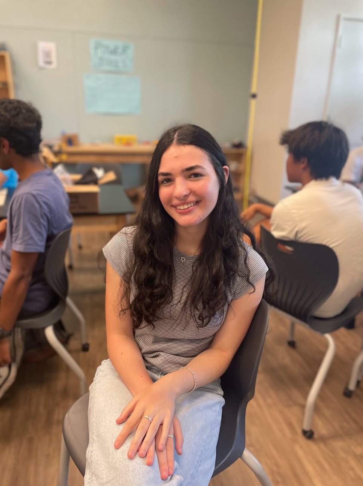
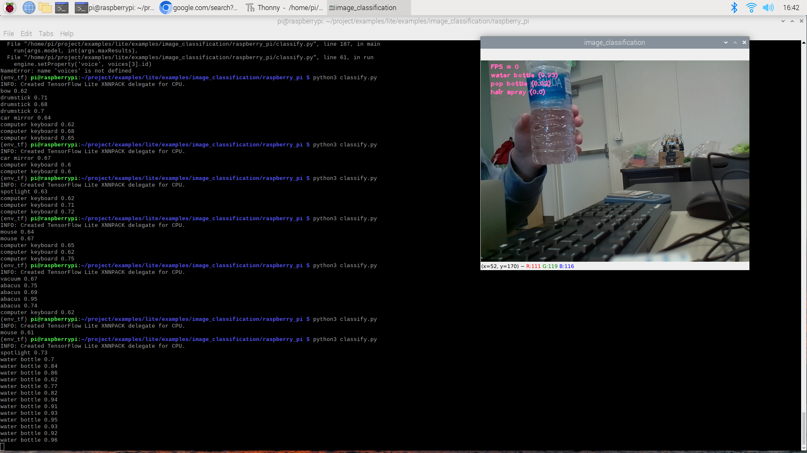
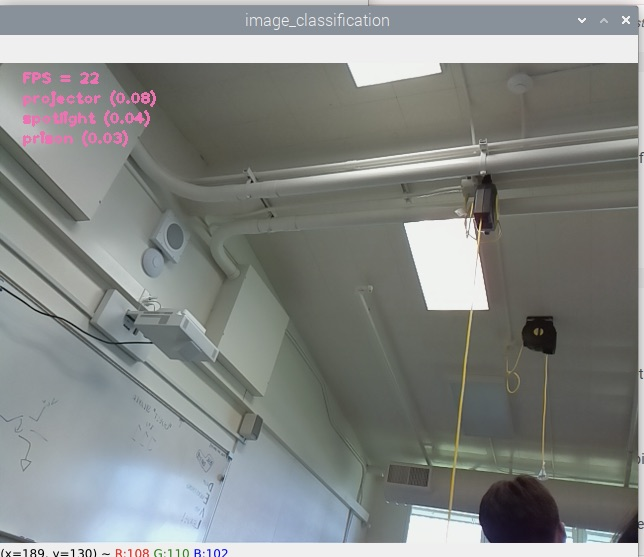
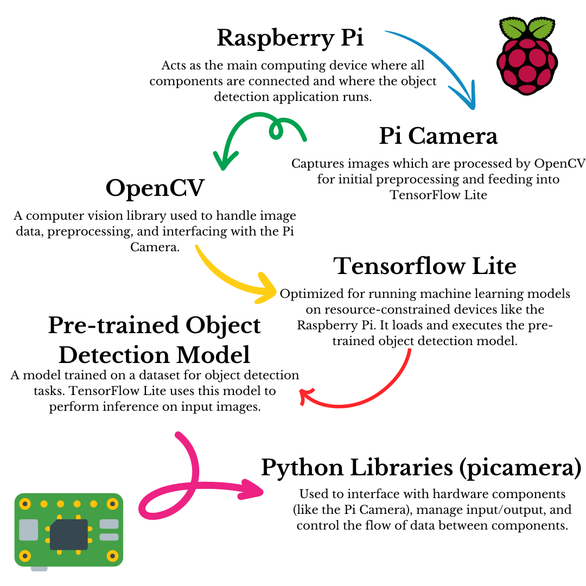

# Object Recognition Glasses
<!--- Replace this text with a brief description (2-3 sentences) of your project. This description should draw the reader in and make them interested in what you've built. You can include what the biggest challenges, takeaways, and triumphs from completing the project were. As you complete your portfolio, remember your audience is less familiar than you are with all that your project entails!

You should comment out all portions of your portfolio that you have not completed yet, as well as any instructions:
```HTML 
<!--- This is an HTML comment in Markdown -->
<!--- Anything between these symbols will not render on the published site 
```
-->
<!---| **Engineer** | **School** | **Area of Interest** | **Grade** |
|:--:|:--:|:--:|:--:|-->
| Zoe M | SAR High School | Electrical Engineering | Incoming Senior |

<!--- **Replace the BlueStamp logo below with an image of yourself and your completed project. Follow the guide [here](https://tomcam.github.io/least-github-pages/adding-images-github-pages-site.html) if you need help.** -->


  
<!--- # Final Milestone

**Don't forget to replace the text below with the embedding for your milestone video. Go to Youtube, click Share -> Embed, and copy and paste the code to replace what's below.**

<iframe width="560" height="315" src="https://www.youtube.com/embed/F7M7imOVGug" title="YouTube video player" frameborder="0" allow="accelerometer; autoplay; clipboard-write; encrypted-media; gyroscope; picture-in-picture; web-share" allowfullscreen></iframe>

For your final milestone, explain the outcome of your project. Key details to include are:
- What you've accomplished since your previous milestone
- What your biggest challenges and triumphs were at BSE
- A summary of key topics you learned about
- What you hope to learn in the future after everything you've learned at BSE-->


# Second Milestone

<iframe width="560" height="315" src="https://www.youtube.com/embed/y3VAmNlER5Y" title="YouTube video player" frameborder="0" allow="accelerometer; autoplay; clipboard-write; encrypted-media; gyroscope; picture-in-picture; web-share" allowfullscreen></iframe>

For my second milestone, I implemented a text-to-speech model (TTS) into my project, which takes the classification and reads it out loud into an earpiece. 

**How I did this:**
I started by researching different text-to-speech models on the Internet. I landed on the pyttsx3 model, which is a pre-trained model that works well with the Raspberry Pi due to its straightforward Python interface, offline functionality, customizable speech parameters, and compatibility with Python 3. 

```shell
Pip install pyttsx3
```
```python
Import pyttsx3
```
<sub>Installing and importing pyttsx3</sub>

First, I installed the TTS model into my console so I could import it into my Python file, where my script is running to perform the object recognition. 

```python
#intializes the text to speech engine using the pyttsx3 library 
engine = pyttsx3.init()
engine.setProperty(‘rate’, 90) #speed of speech (wpm)
engine.setProperty(‘volume’, 1.0) #volume of speech (scale of 0.0 - 1.0)
```
<sub>creating engine and setting properties for speech</sub>

After I imported the TTS model into my code, I initialized the engine using the pyttsx3 library. This means I set up a TTS engine that can convert written text into spoken words using the data from the pyttsx3 library. I then set the speed and volume of the speech to 90 words per minute (wpm) and the loudest volume. 

```python
# Show classification results on the image
    for idx, category in enumerate(categories.classifications[0].categories): #iterates through each category detected by the classifier
      category_name = category.category_name #retrieves name of category
      score = round(category.score, 2) #rounds confidence score of the category to 2 decimal places
      result_text = category_name + ' (' + str(score) + ')' #text string that combines the category name and score
      text_location = (_LEFT_MARGIN, (idx + 2) * _ROW_SIZE) #determines position where text will be displayed on the image
      cv2.putText(image, result_text, text_location, cv2.FONT_HERSHEY_PLAIN,
                  _FONT_SIZE, _TEXT_COLOR, _FONT_THICKNESS) #draws text onto image at the specified location
      if score >= 0.6: #checks if confidence score is greater than or equal to 0.6
          print("{} {}".format(category_name, score)) #prints the category name and score to the console
```
<sub>Showing the classification code and the print function that prints above a score of 0.6</sub>



My next step was to get the model to print only the high confidence scores into my console so that they would be the correct object feasibly. I chose a score greater than or equal to 0.6, which means the model is 60% sure that the input object is that exact classification. I noticed that when objects were wrongly detected, they usually had very low confidence scores. Therefore, 60% is a suitable tested threshold for the model. I wrote an if statement that checks if the score is greater than or equal to 0.6, and then if that returns true, it prints the category name and score to the console. 

```python
engine.say(category_name) #uses text-to-speech engine to speak category name
engine.runAndWait() #ensures the TTS engine finishes speaking before continuing
```
<sub>Code showing speak and wait functions of the TTS model</sub>

After I got the model to print only the classifications with a confidence score of 0.6 and above it was time to get the model to actually say those classifications. So I wrote the line “engine.say(category_name)” which says only the category name of the classifications with a confidence score of 0.6 and above. The final step was the let the TTS engine know to wait until it finishes speaking a word to continue with the next word. 

```shell
Speaker-test -c4 -twav -13
```
<sub>Code testing the speaker</sub>

I then tested the earpiece using the code above before running my classification code to ensure it was working correctly and that I could hear the words well. After I confirmed the price was working, it was time to run the “python3 classify.py” script, and it worked!

After I completed the TTS model, I wanted to start profiling my code and adding comments to make it easier for myself and others to understand. See the complete code below.

**What surprised me so far:**
So far, I’ve been surprised by how many resources there are on the Internet for coding and engineering in general. When in doubt, if I run into an error and Google it, there is usually someone who has gone through a similar difficulty and solved the problem. I love how open the engineering community is and how willing everyone is to help out each other. This culture of sharing knowledge has empowered me to develop significantly as an engineer. It has allowed me to independently tackle challenges by conducting research and investing time, without having to rely on the immediate availability of a teacher or mentor.

**Challenges:**
My main challenge with this milestone was writing the code for speaking the classification out loud without researching return values. Return values are how functions communicate what they have done or calculated back to the rest of your program. However, originally, I put the entire print statement into my speak function. 

```python
engine.say(print("{} {}".format(category_name, score))
```
<sub>Speak function that would return "none"</sub>

The problem with doing so is that print does not have a return value because its purpose is just to print text onto the console. Therefore, my earpiece kept saying “none” for every object classification. It took me a while to figure out what the TTS model was saying and then out why it was saying “none”. After I realized it was because I put the print statement into my speak function, I quickly changed this to “category_name” and it was working. 

**Next:**

I need to make sure I attach the Raspberry Pi, the camera, and the earpiece to my glasses before reaching my final milestone. After that, I will test all the components using a portable charger to ensure everything works properly and can be portable. 


# First Milestone

<!--- **Don't forget to replace the text below with the embedding for your milestone video. Go to Youtube, click Share -> Embed, and copy and paste the code to replace what's below.** -->

<iframe width="560" height="315" src="https://www.youtube.com/embed/O-T2S3FNzZ4?si=XUDs_auTNl4_j2Pt" title="YouTube video player" frameborder="0" allow="accelerometer; autoplay; clipboard-write; encrypted-media; gyroscope; picture-in-picture; web-share" referrerpolicy="strict-origin-when-cross-origin" allowfullscreen></iframe>

For my first milestone I performed object recognition using machine learning. I ran this on a Raspberry Pi (a credit card sized computer) and a Pi Camera. 

**How I did this:** 
First I needed to setup up my Raspberry pi. My main guide in doing so was Adafruit’s tutorial (see resource 1 below). First I chose the Raspberry Pi operating system (OS) (64 bit) since that was most compatible with my Pi. 

```shell
sudo apt update 
sudo apt upgrade
sudo apt install python3.11-venv
python -m venv env --system-site-packages
source env/bin/activate
```
<sub>Setting up a virtual enviorment and installing python</sub>

I then updated and upgraded my Raspberry Pi so that everything in the Raspberry pi was up to date. Then I had to download python onto my Raspberry Pi so I could utilize it to use other libraries later on. I did this on a virtual environment, a space where you can install different versions of software or libraries without them interfering with each other. 

```shell
cd ~
sudo pip3 install --upgrade adafruit-python-shell
wget https://raw.githubusercontent.com/adafruit/Raspberry-Pi-Installer-Scripts/master/raspi-blinka.py
sudo python3 raspi-blinka.py
```
<sub>Installing dependencies</sub>

This code ensured my Pi was configured correctly and mostly just installed the dependencies, the building blocks or "ingredients" that software relies on to do its job effectively. After all that was downloaded onto my Pi it was time to attach my camera and test it out to ensure it worked. 

```shell
libcamera-hello
```

I connected the camera to the pi and needed to test it. I typed out this command to test my camera and it turned on and it started working by showing a live feed window of what the camera sees. After the camera was working it was time to implement the object detection. I followed a tutorial by Sam Westby Tech to download the necessary libraries to get the object detection working.

```shell
mkdir project
cd project
source env_tf/bin/activate
sudo apt install -y build-essential cmake pkg-config libjpeg-dev libtiff5-dev libpng-dev libavcodec-dev libavformat-dev libswscale-dev libv4l-dev libxvidcore-dev libx264-dev libfontconfig1-dev libcairo2-dev libgdk-pixbuf2.0-dev libpango1.0-dev libgtk2.0-dev libgtk-3-dev libatlas-base-dev gfortran libhdf5-dev libhdf5-serial-dev libhdf5-103 libqt5gui5 libqt5webkit5 libqt5test5 python3-pyqt5 python3-dev
pip install "picamera[array]"
Pip install opencv-python
python3
import cv2
cv2.__version__
```
<sub>Making a new directory and downloading OpenCV and Picamera libraries</sub>

First I wanted to make a new directory called project, which is basically making a new folder to store things. Then I activated a new virtual environment since I would be downloading a lot of packages and libraries. Next, I needed to install a bunch of system packages, which provide essential tools and updates that allow your operating system and applications to work correctly and securely. After that was done, I installed two libraries called picamera and opencv which allowed my pi to work with the camera and get data from the camera. 

```shell
python3 -m pip install tflite-runtime
python3
import tflite_runtime
tflite_runtime.__version__
quit()
```
<sub>Installing Tensorflow Lite</sub>

Following this I was able to install Tensorflow Lite which provides pre-trained models for various tasks like object detection, which is trained on labeled data. Once the pre-trained model is integrated, the tensorflow lite interpreter runs an inference on input images fed into the model and outputs detection. This means it takes the input images, puts it through its network and performs a variety of math operations. After, it produces an output with a confidence score of how certain the model is that the input is a certain object. 

```shell
git clone https://github.com/tensorflow/examples --depth 1
cd examples/lite/examples/image_classification/raspberry_pi/
sh setup.sh
sudo apt-get install libatlas-base-dev
python3 classify.py
```
<sub>Installing pre-trained Tensorflow Lite ML model</sub>



Afterwards I downloaded a pre-made machine learning data set that Tensorflow Lite created so I could use it for my object detection. Then I tested it by executing the python script “python3 classify.py” which runs the code in the file classify.py and my object detection was working!



**Challenges:**
The tutorial I was following for setting up my camera was a bit outdated and instructed me to turn on settings on my pi that actually were not compatible with the code I was running. Therefore my camera was not turning on. After realizing this I turned off the settings the tutorial had me turn on and my camera started working!

```shell
python3 -m pip install --upgrade tflite-support==0.4.3
```

Also, when downloading Tensorflow Lite I got an error message. Through searching google I found out it was because a package within the Tensorflow Lite library was not compatible with my versions of python and opencv. Therefore I had to execute a command that downgraded the version of that package so it was compatible with my versions of python and opencv. Once I did that Tensorflow Lite downloaded!

Additionally, the image classification is not the most accurate because it's a pre-trained model so in future milestones I hope to be able to narrow down the classifications so it only tells the user when it is pretty sure of its object classification. 

**Future Plan:**
I want to get the classification to be told out loud through the ear piece and put it onto the glasses. This aspect is essential to my project because it allows the user to be able to hear what the classification is that Tensorflow Lite has detected. Based on a study from ARVO journals, in 2020 there were 49.1 million people who were blind globally. Therefore it is crucial that these people have a device that enables them to navigate their everyday lives more easily and be able to detect object they run into during their days. 

<!---
# Schematics 
Here's where you'll put images of your schematics. [Tinkercad](https://www.tinkercad.com/blog/official-guide-to-tinkercad-circuits) and [Fritzing](https://fritzing.org/learning/) are both great resoruces to create professional schematic diagrams, though BSE recommends Tinkercad becuase it can be done easily and for free in the browser. 

# Code
Here's where you'll put your code. The syntax below places it into a block of code. Follow the guide [here]([url](https://www.markdownguide.org/extended-syntax/)) to learn how to customize it to your project needs. 

```c++
void setup() {
  // put your setup code here, to run once:
  Serial.begin(9600);
  Serial.println("Hello World!");
}

void loop() {
  // put your main code here, to run repeatedly:

}
```
-->
# Bill of Materials
<!--- Here's where you'll list the parts in your project. To add more rows, just copy and paste the example rows below.
Don't forget to place the link of where to buy each component inside the quotation marks in the corresponding row after href =. Follow the guide [here]([url](https://www.markdownguide.org/extended-syntax/)) to learn how to customize this to your project needs. -->

| **Part** | **Note** | **Price** | **Link** |
|:--:|:--:|:--:|:--:|
| Raspberry Pi 4 | Allows the interaction between the software and hardware for the camera and audio system | $58.99 | <a href="https://www.amazon.com/dp/B0CMZST24Y?ref=cm_sw_r_cso_cp_apin_dp_Y63HAE5CHH0DGMEAV253_1&ref_=cm_sw_r_cso_cp_apin_dp_Y63HAE5CHH0DGMEAV253_1&social_share=cm_sw_r_cso_cp_apin_dp_Y63HAE5CHH0DGMEAV253_1&starsLeft=1"> Link </a> |
| Camera Module | Taking videos for the object recognition | $14.49 | <a href="https://www.amazon.com/dp/B01ER2SKFS?ref=cm_sw_r_cso_cp_apin_dp_1CTZAM6W55YVQMMQNVET&ref_=cm_sw_r_cso_cp_apin_dp_1CTZAM6W55YVQMMQNVET&social_share=cm_sw_r_cso_cp_apin_dp_1CTZAM6W55YVQMMQNVET&starsLeft=1"> Link </a> |
| Raspberry Pi audio expansion board | Enables the connection between the Pi and the audio | $25.99 | <a href="https://www.amazon.com/dp/B0D12M8D2T?ref=cm_sw_r_cso_cp_apin_dp_8G3N848P2VK3FW7TT4BB_1&ref_=cm_sw_r_cso_cp_apin_dp_8G3N848P2VK3FW7TT4BB_1&social_share=cm_sw_r_cso_cp_apin_dp_8G3N848P2VK3FW7TT4BB_1&starsLeft=1"> Link </a> |
| Ear Piece | Allows user to hear the audio in ear | $10.95 | <a href="https://www.amazon.com/dp/B07YZ6LLDH?ref=cm_sw_r_cso_cp_apin_dp_04A8H7YD6WEPZYG52YZK&ref_=cm_sw_r_cso_cp_apin_dp_04A8H7YD6WEPZYG52YZK&social_share=cm_sw_r_cso_cp_apin_dp_04A8H7YD6WEPZYG52YZK&starsLeft=1"> Link </a> |
| Glasses | Allows user to wear the device | $5.99 | <a href="https://www.amazon.com/dp/B0BSF4PL2Q?ref=cm_sw_r_cso_cp_apin_dp_9G1KS2KBDABJZ2GR6485&ref_=cm_sw_r_cso_cp_apin_dp_9G1KS2KBDABJZ2GR6485&social_share=cm_sw_r_cso_cp_apin_dp_9G1KS2KBDABJZ2GR6485&starsLeft=1"> Link </a> |
| Wires | Enables everything to be connected to allow information to flow | $6.98 | <a href="https://www.amazon.com/dp/B01EV70C78?ref=cm_sw_r_cso_cp_apin_dp_CCVPR26GTMPF9EXHBMFR&ref_=cm_sw_r_cso_cp_apin_dp_CCVPR26GTMPF9EXHBMFR&social_share=cm_sw_r_cso_cp_apin_dp_CCVPR26GTMPF9EXHBMFR&starsLeft=1"> Link </a> |

<!---# Other Resources/Examples
One of the best parts about Github is that you can view how other people set up their own work. Here are some past BSE portfolios that are awesome examples. You can view how they set up their portfolio, and you can view their index.md files to understand how they implemented different portfolio components.
- [Example 1](https://trashytuber.github.io/YimingJiaBlueStamp/)
- [Example 2](https://sviatil0.github.io/Sviatoslav_BSE/)
- [Example 3](https://arneshkumar.github.io/arneshbluestamp/)

To watch the BSE tutorial on how to create a portfolio, click here. -->
